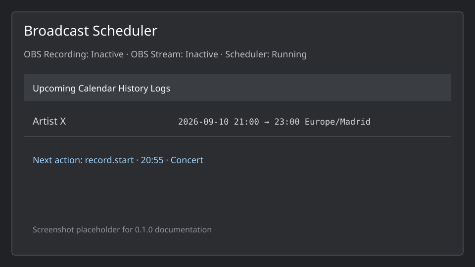

# Broadcast Scheduler

Broadcast Scheduler is a native OBS Studio 32.x plugin for reliable, local scheduling of recordings, streams and OBS actions. It targets unattended concert rooms, churches, radio, universities, studios, podcasts, conferences and sports production. Version `0.1.0` is prerelease.

The plugin provides manual events, RRULE-style recurrences, remote and local ICS, Google Calendar, a localhost REST API, reusable action templates, durable SQLite state, execution history, missed-action handling and output ownership protection. Providers normalize data into one internal event model and never call OBS directly.



## What is implemented

The OBS dock shows the next events, a functional agenda, calendar day/week/month filters, history and logs. Manual events can be created, edited, duplicated, disabled and deleted. Built-in templates include Concert, Podcast, Livestream, Recording Only and Church Service. Action rows support start/end reference, signed offsets and JSON parameters.

Actions include recording and streaming start/stop/pause/resume, current and preview scene, source visibility/enabled state, replay buffer, registered hotkey, an argument-vector local command and an HTTPS/loopback HTTP webhook. Advanced actions require an explicit setting. Recording and streaming starts never adopt an already-active operator output by default. Stops require ownership unless the safety override is enabled. Ask and grace policies persist through restart.

ICS subscriptions accept HTTPS URLs and local files, with manual/automatic refresh, calendar enablement, template mapping and offsets. libical handles DTSTART, DTEND, UID, DESCRIPTION, TZID, all-day events and common recurrence expansion. Google Calendar uses the official read-only API through desktop OAuth 2.0 with PKCE; client credentials are supplied by the developer and are never committed.

The API is disabled by default and binds to `127.0.0.1` by default. It requires a Bearer token whose SHA-256 hash is persisted. See [docs/api.md](docs/api.md), [docs/openapi.json](docs/openapi.json) and [docs/google-calendar.md](docs/google-calendar.md).

## Install on Windows

1. Download `Broadcast-Scheduler-0.1.0-Setup.exe` from the CI artifact.
2. Close OBS Studio 32.x and run the installer. Windows may ask for administrator approval because OBS is normally installed under `Program Files`.
3. Select the OBS installation folder if it is not detected automatically. The installer validates that the folder contains the 64-bit OBS executable.
4. Start OBS and use `Docks → Broadcast Scheduler`. The plugin also opens the dock on first load; it can be hidden and restored from the Docks menu.

The ZIP `broadcast-scheduler-0.1.0-windows-x64.zip` remains available for portable OBS installations or manual deployment. The installer does not remove the scheduler database, history or settings when uninstalled.

The package contains the plugin DLL, locale files, bundled libical timezone data and only the extra Qt modules needed by this plugin. It must use the same Qt ABI as the OBS installation. Rebuild after an OBS Qt upgrade. The database path is shown in Settings → Advanced and is normally `%APPDATA%\obs-studio\plugin_config\broadcast-scheduler\scheduler.sqlite3`.

Build details and the exact Windows dependency workflow are in [docs/build.md](docs/build.md). Do not copy SDK Qt Core/Gui/Widgets DLLs over OBS files.

## Quick test

In the dock, click Add Event. Leave the default Recording Only template, set start two minutes from now and end two minutes after that, then enable the event. The first action starts recording and the second stops it. Use a writable recording directory configured in OBS. The history tab must show the two actions and the dashboard must show OBS Recording active between them.

For API testing, generate a token in Settings → API, enable the server, then:

```sh
curl -X POST http://127.0.0.1:8766/api/v1/events \
  -H 'Authorization: Bearer YOUR_TOKEN' \
  -H 'Content-Type: application/json' \
  --data '{"title":"Artist X","start":"2026-09-10T21:00:00+02:00","end":"2026-09-10T23:00:00+02:00","template":"Concert"}'
```

For an ICS calendar, open Calendars, choose Add Calendar, select Remote ICS or Local ICS file, provide the URL/path, choose a template and save. Remote feeds require HTTPS. For Google, configure a Google Cloud Desktop OAuth client, enable Calendar API, enter the client ID/secret in Settings → Google, connect the account in the browser and select calendars. The provider is read-only.

## Build and tests

Linux development uses the isolated Docker environment:

```sh
docker build -f Dockerfile.dev -t broadcast-scheduler-dev .
docker run --rm -v "$PWD:/work" broadcast-scheduler-dev bash -lc \
  'cmake -S . -B build -G Ninja -DOBS_SOURCE_DIR=/opt/obs-src -DCMAKE_BUILD_TYPE=Debug && cmake --build build -j2 && ctest --test-dir build --output-on-failure'
```

The QtTest suite covers offsets, overnight events, recurrence, monthly rules, DST, ICS parsing, all-day events, deduplication, update/delete, calendar atomic replacement, restart claims, missed actions, same-time actions and ownership. `tests/api_integration.py` exercises real HTTP CRUD, authentication, validation and sync. `tests/obs_smoke.py` starts real OBS under Xvfb and validates the dock, a native scheduled recording, generated media and confirmed history; its optional streaming portion requires a working local RTMP listener and OBS stream service.

The supported Windows build is `pwsh -File scripts/build-windows.ps1` from a Visual Studio 2022 x64 developer shell. GitHub Actions builds/tests Windows and Linux. macOS portability is prepared in the source and CMake paths but its signed bundle is not release-validated in this environment.

## Safety and reliability model

An execution key is claimed in SQLite before dispatch. This provides at-most-once dispatch across clock jumps and restarts. If OBS exits after a claim and before confirmation, history records `indeterminate` and the plugin does not blindly repeat a potentially destructive action. OBS callbacks update the final result when available. Event changes invalidate pending deferrals; external calendar replacement is transactional and preserves the previous snapshot on parse or network errors.

Only an output intentionally started by Broadcast Scheduler is owned by it. Manual recording/streaming remains active when a scheduled stop arrives unless the explicit safety override is enabled. The default for an already-active output is Leave active. Configure exact, ask-before-stop or grace-period policies separately for recording and streaming.

## Troubleshooting

Check OBS Help → Log Files and the plugin Logs tab. A missing start/stop is usually an OBS output configuration, encoder, disk path, permission, stream service or ownership policy issue. If the API cannot start, regenerate its token and check the configured port. If an ICS feed fails, verify HTTPS, certificate validity, UID/DTEND and the log entry. Google `invalid_grant` requires reconnecting; a real account test also needs the developer's OAuth consent screen and test user. Never put refresh tokens, API tokens, signed calendar URLs or client secrets in issue reports.

## Development

See [docs/architecture.md](docs/architecture.md) for threading, provider boundaries, action claims and safety guarantees. New providers should publish normalized snapshots into `Store`; they should not depend on Google or the OBS adapter. This leaves room for Microsoft 365, CalDAV, Odoo, Home Assistant, MQTT and inbound webhook providers.

## License

Broadcast Scheduler source is GPL-2.0-or-later. The combined plugin links Qt HTTP Server, which uses the GPLv3 distribution option, so distributed combined binaries are GPLv3. See [LICENSE](LICENSE), [THIRD_PARTY.md](THIRD_PARTY.md) and the dependency notices.
