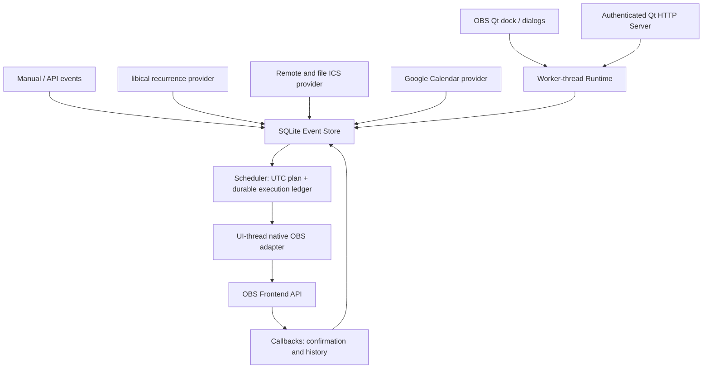

# Architecture and guarantees

`model.*`: normalized Event, Template, Action and Due values, validation and ordered offset calculation. Event sources are Manual, Recurring, ICS, GoogleCalendar and API. Times are signed UTC epoch milliseconds; JSON uses ISO 8601 with explicit offsets. IANA timezone remains attached for display and recurrence wall time. API requests without offsets are rejected.

`store.*`: a single worker owns SQLite. Migration 1 creates events, templates, configuration, executions, deferred decisions and logs. `PRAGMA user_version` rejects newer unknown schemas. WAL, FULL synchronous mode, prepared statements and transactions protect data. Provider replacement commits only a complete validated snapshot. Failures preserve the previous calendar. Event identity is unique `(calendar, external_id)`. ICS non-recurring identity is UID; recurring identity is UID plus original occurrence time; detached overrides retain RECURRENCE-ID. Google identity uses the Calendar API instance ID. Manual/API updates preserve IDs.

`scheduler.*`: a 250 ms precise timer compares UTC time, not elapsed ticks. Forward/backward clock jumps are reevaluated; durable IDs suppress duplicates after backward changes. The action identity is `event.id/action.id`, deliberately independent of event timestamps: moving an event or changing an executed action's parameters does not replay it. New action IDs are new work. Plans are cached by store revision. Unexecuted changes take effect on the next tick; deletion/disabled calendars remove pending work. Deleting an active event does not stop an output; operators must handle the now-orphaned recording explicitly.

Before any side effect, `INSERT OR IGNORE` reserves its execution key durably. A crash between reservation and effect produces `indeterminate`, never an automatic retry. There is **at-most-once dispatch, not exactly-once external effects**: SQLite cannot atomically commit a hardware/network side effect with OBS. History distinguishes requested, succeeded, failed, skipped, cancelled and indeterminate. Native recording/streaming callbacks confirm actual transitions. Commands/webhooks are asynchronous; inspect logs for completion. No blind retries of side effects.

Missed actions within tolerance execute; outside tolerance use Ignore, Execute immediately or Ask. Ignore is default. Immediate never starts a finished event. Ask persists an unanswered decision and reopens it after restart. Stop Ask prompts up to five minutes early; no response leaves the output running. Closing the dialog cancels that scheduled action. Extensions and grace deadlines survive restart. Editing the event or template invalidates its prior stop deferral. Pausing does not stop active outputs; resuming applies missed-action rules.

`obs-adapter.*`: only this module calls OBS, via the Qt UI thread. A synchronous queued bridge marshals short native calls from the worker. Output starts use the frontend API and a queued main-object fallback for OBS builds whose wrapper routes through a different frontend thread; both paths remain asynchronous and the adapter never calls a potentially modal OBS failure dialog from the scheduler thread. Outputs have per-event in-memory leases, acquired only following an intentional start. An operator-owned active output is never adopted just because Start is scheduled. Multiple scheduler events share leases; only the last owner's Stop can stop the output. Ownership is deliberately not restored across process restarts: OBS outputs themselves do not survive exit. Existing-output policies are Leave (default), Ignore and guarded Restart. Explicit “allow stopping outputs started outside Scheduler” overrides operator protection. Pause/resume and advanced hotkeys are guarded too. Sources/scenes and replay buffer use native APIs. Commands use executable plus argument vector, no shell string; common shell interpreters are rejected. Advanced actions are disabled by default.

`providers.*`: QNetworkAccessManager is asynchronous in the worker thread. File reads and ICS expansion use a dedicated pool. Libical's global timezone/parser state is serialized with a mutex. Calendar refreshes do not overlap per source; successful full snapshots include a rolling window from seven days ago through 400 days ahead. Disabled calendars retain cached data but cannot execute. Configuration changes invalidate in-flight snapshots. New providers must publish validated snapshots through Store, never call OBS. Outlook, CalDAV, Odoo, MQTT and other integrations can implement the same boundary; they are not built in.

`api.*`: optional, disabled by default, localhost by default; Bearer token compared through fixed-length SHA-256 hashes. Raw token is displayed once and only its hash is persisted. No CORS; browser Origin requests rejected. Qt owns HTTP parsing. Application JSON body cap 1 MiB; this is checked after Qt has received the request, not a transport-layer memory guarantee. Trusted local networks only, never expose directly to the Internet.

UI uses OBS locales en-US/es-ES and inherited Qt styles. Calendar Day/Week/Month select a date interval and list intersecting events; these are not drag-and-drop time-grid editors. Templates have ordered rows, stable action IDs, reference/offset/action widgets and JSON parameter editing. Recurrences use an RRULE editor with examples, not a natural-language rule builder.

Limitations to qualify before unattended production: OBS encoder/output errors, sleep/resume, real Windows DPAPI, Windows Qt ABI compatibility, Google consent, DST at nonexistent/ambiguous local times, high-volume calendars and output-stop failures. Qt's local-time disambiguation is used; enter explicit offsets via API for an exact fold occurrence. No automatic computer wake-up. SQLite logs/history have no automatic retention deletion; back up and manage growth.
